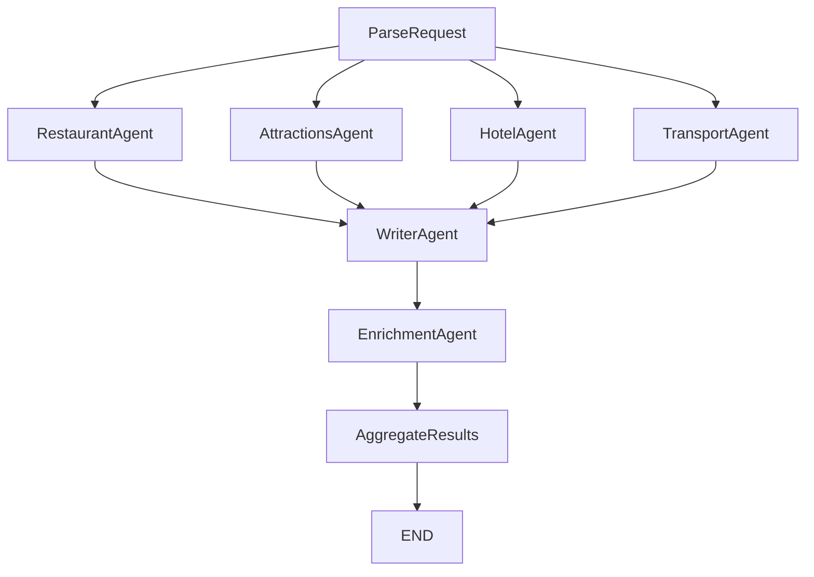

# Spot On — Technical Documentation

## System Overview
Spot On is a multi-agent travel recommendation system with:

- **Frontend (Next.js)**: collects user input, starts a run, streams progress, and renders/export results.
- **Backend (FastAPI + LangGraph)**: parses the request, runs 4 domain agents in parallel, enriches results, and aggregates the final response.
- **MongoDB (Atlas or local)**: stores run lifecycle, progress events, and artifacts.
- **Tavily API**: provides grounded search + page extraction.
- **OpenAI**: used via structured outputs to parse/normalize results.

Primary entrypoints:
- Backend app: `backend/app/main.py`
- Graph definition: `backend/app/graph/graph.py`
- Frontend UI: `frontend/app/page.tsx`

## Architecture & Agent Roles

### LangGraph
Source: `backend/app/graph/graph.py`, `backend/app/graph/nodes/parse.py`, `backend/app/graph/nodes/aggregate_results.py`

1. **ParseRequest** (`backend/app/graph/nodes/parse.py`)
   - Validates structured `constraints` (origin, destination, dates) and derives query context for downstream agents.
2. **Domain Agents** (parallel fan-out; **search only** - return raw results)
   - **RestaurantAgent** (`backend/app/agents/restaurant.py`): returns top 15 raw restaurant search results.
   - **AttractionsAgent** (`backend/app/agents/attractions.py`): returns top 15 raw attraction search results.
   - **HotelAgent** (`backend/app/agents/hotel.py`): returns top 15 raw hotel search results.
   - **TransportAgent** (`backend/app/agents/transport.py`): returns 15 car rentals + 15 flights (internally parallelizes car + flight subsearches).
3. **WriterAgent** (`backend/app/agents/writer.py`)
   - Waits for all 4 domain agents to complete (fan-in join).
   - Runs **5 parallel LLM normalizations** to convert raw results into structured top picks.
   - Produces: 4 restaurants, 4 attractions, 4 hotels, 3 car rentals, 3 flights (**18 total top picks**).
   - Computes **references** field: raw items not selected as top picks (fallback options).
4. **EnrichmentAgent** (`backend/app/agents/enrichment.py`)
   - Collects URLs from restaurants, attractions, and hotels only (~12 items). Car rentals and flights are not enriched.
   - Batch calls Tavily Extract (20 URLs at once).
   - Uses LLM to parse extracted content for price, hours, address, phone.
5. **AggregateResults** (`backend/app/graph/nodes/aggregate_results.py`)
   - Merges enrichment data by `id` into each item and builds `final_output`.

### Why this is "multi-agent"
Each domain agent has a single responsibility and can evolve independently (queries, ranking, schemas, timeouts). LangGraph coordinates the workflow and ensures the WriterAgent waits for all 4 domain agents, then runs 5 parallel LLM normalizations. This **separation of search (I/O bound) from normalization (CPU bound)** enables dual parallelism for optimal performance.

## LangGraph Flow
Source: `backend/app/graph/graph.py`



- Entry point: `ParseRequest`
- **First fan-out**: `ParseRequest -> {RestaurantAgent, AttractionsAgent, HotelAgent, TransportAgent}` (4 parallel search agents)
- **First join**: `{RestaurantAgent, AttractionsAgent, HotelAgent, TransportAgent} -> WriterAgent`
- **Second parallelism**: WriterAgent internally runs 5 LLM normalizations in parallel
- Sequential: `WriterAgent -> EnrichmentAgent -> AggregateResults -> END`

**Key innovation:** Domain agents search in parallel (4x). WriterAgent waits for all 4 (join pattern), then runs 5 LLM normalizations in parallel. This dual parallelism (search + normalization) delivers ~15s total vs ~25-30s sequential.

Operational notes:
- Node execution is wrapped with `_wrap(...)` to emit progress events to MongoDB (`append_event`, `set_node_progress`).
- Join behavior is handled by LangGraph; WriterAgent waits until all 4 domain agents complete.

## Agent Roles - Detailed Responsibilities

### ParseRequest Node
**File:** `backend/app/graph/nodes/parse.py`
- Validates constraints (dates, origin, destination)
- Derives query context (destination_city, airport_code, trip_nights, etc.)

### Domain Agents (Parallel Execution - Search Only)
All domain agents share the same pattern:
- Build multiple search queries (deterministic)
- Execute parallel Tavily searches
- Deduplicate by URL
- Return TOP_N raw results sorted by relevance score

**RestaurantAgent** (`backend/app/agents/restaurant.py`)
- TOP_N = 15 raw results
- Queries: "best restaurants", "local favorites", "hidden gems"
- Returns: `raw_restaurants`

**AttractionsAgent** (`backend/app/agents/attractions.py`)
- TOP_N = 15 raw results
- Queries: "must see attractions", "top things to do", "best places to visit"
- Returns: `raw_travel_spots`

**HotelAgent** (`backend/app/agents/hotel.py`)
- TOP_N = 15 raw results
- Queries: "best hotels", "top rated hotels"
- Returns: `raw_hotels`

**TransportAgent** (`backend/app/agents/transport.py`)
- CAR_TOP_N = 15, FLIGHT_TOP_N = 15
- Internally parallelizes car rental + flight searches
- Returns: `raw_car_rentals`, `raw_flights`

### WriterAgent (5 Parallel LLM Calls)
**File:** `backend/app/agents/writer.py`

**Purpose:** Normalizes raw search results into structured top picks using specialized prompts.

**Execution:**
- Waits for all 4 domain agents to complete (LangGraph join)
- Runs 5 LLM normalization calls in parallel using `asyncio.gather`
- Each category uses domain-specific prompts with guardrails

**Output counts:**
- 4 restaurants (RESTAURANT_TOP = 4)
- 4 attractions (ATTRACTION_TOP = 4)
- 4 hotels (HOTEL_TOP = 4)
- 3 car rentals (CAR_TOP = 3)
- 3 flights (FLIGHT_TOP = 3)
- **Total: 18 top picks**

**References field:**
- Computes items from raw_* that weren't selected as top picks
- Provides fallback options if enrichment fails

**Why separate normalization from search?**
- Search is I/O bound (parallel Tavily calls)
- Normalization is CPU bound (LLM processing)
- Allows independent scaling and optimization
- Prevents redundant search queries when LLM needs retry

### EnrichmentAgent (Tavily Extract + LLM Parsing)
**File:** `backend/app/agents/enrichment.py`
- Collects URLs from restaurants, attractions, and hotels upto 12 items
- Car rentals and flights are excluded from enrichment (low-quality aggregator pages)
- Batch calls Tavily extract (20 URLs at once)
- Uses LLM to parse extracted content for price, hours, address, phone
- Returns: `enriched_data` dict (item_id → enriched fields)
- PHASE1_CAP = 12 (3 types × 4 items)

### AggregateResults Node
**File:** `backend/app/graph/nodes/aggregate_results.py`
- Merges enriched_data into each item by ID
- Builds final_output with all categories
- Returns status "done"


## State Management Design

**File:** `backend/app/graph/state.py`

**Key patterns:**

### Raw Fields (Parallel Merge with operator.add)
```python
raw_restaurants: Annotated[list[dict[str, Any]], operator.add]
raw_travel_spots: Annotated[list[dict[str, Any]], operator.add]
raw_hotels: Annotated[list[dict[str, Any]], operator.add]
raw_car_rentals: Annotated[list[dict[str, Any]], operator.add]
raw_flights: Annotated[list[dict[str, Any]], operator.add]
```
- Each domain agent writes to its raw_* field
- LangGraph merges lists automatically when parallel agents complete
- WriterAgent reads from raw_* fields

### Top Picks (Overwrite)
```python
restaurants: list[dict[str, Any]]
travel_spots: list[dict[str, Any]]
hotels: list[dict[str, Any]]
car_rentals: list[dict[str, Any]]
flights: list[dict[str, Any]]
```
- WriterAgent writes normalized top picks
- Overwrites (not appends)

### References
```python
references: list[dict[str, Any]]
```
- Raw items not selected as top picks
- Provides fallback if enrichment fails
- Computed by WriterAgent

### Agent Statuses (Parallel Merge with operator.or_)
```python
agent_statuses: Annotated[dict[str, str], operator.or_]
```
- Each agent writes `{agent_id: "completed"|"failed"|"partial"}`
- LangGraph merges dicts: `{a: 1} | {b: 2} = {a: 1, b: 2}`


## Data Model (MongoDB)

Source: `backend/app/db/mongo.py`, `backend/app/db/schemas.py`, `backend/app/main.py`

MongoDB collections:
### `runs` (One run per request)
- `_id`: run id (string, e.g. `run_...`)
- `status`: `queued | running | done | error | cancelled`
- `createdAt`, `updatedAt`
- `options`: feature flags (e.g. `skip_enrichment`)
- `constraints`: structured TravelConstraints (origin, destination, departing_date, returning_date, interests, budget)
- `warnings`: array of strings (accumulated from agents)
- `final_output`: aggregated output (see structure below)
- `error`: `{ message: string }` on failure
- `progress.nodes.<NodeName>`: last known `NodeEventPayload` per node (ParseRequest, RestaurantAgent, AttractionsAgent, HotelAgent, TransportAgent, WriterAgent, EnrichmentAgent, AggregateResults)
- `durationMs`
- `runType`: `"spot_on"`
- `apiVersion`: `1`

**`final_output` structure** (when `status=done`):

- `restaurants`: array of 4 RestaurantOutput items
- `travel_spots`: array of 4 AttractionOutput items
- `hotels`: array of 4 HotelOutput items
- `car_rentals`: array of 3 CarRentalOutput items (not enriched)
- `flights`: array of 3 FlightOutput items (not enriched)
- `references`: array of raw items not selected as top picks
- `agent_statuses`: dict of agent_id → status
- `warnings`: array of warning strings

Indexes (created on startup):
- `runs.updatedAt`
- `runs.status + runs.updatedAt`


### `run_events` (Append-only event log for SSE streaming)
- `runId`, `ts`
- `type`: `node | artifact | log`
- `node`: node name (optional)
- `payload`: event payload

Index:
- `runId + ts + _id`

### `artifacts` (Materialized intermediate/final artifacts)
- `runId`, `ts`
- `type` (e.g. `constraints`, `final_output`)
- `payload`
- `version`

Index:
- `runId + ts + _id`

## Backend API Surface
Source: `backend/app/main.py`
- `POST /api/runs`: create a run with structured `constraints` (origin, destination, dates), enqueue execution, return `{ runId }`.
- `GET /api/runs/{runId}`: fetch run status + progress + output (when done).
- `GET /api/runs/{runId}/events`: SSE stream of progress/events.
- `POST /api/runs/{runId}/cancel`: best-effort cancellation (cancels background task).
- `GET /api/runs/{runId}/export/pdf`: export results as PDF (done-only).
- `GET /api/runs/{runId}/export/xlsx`: export results as XLSX (done-only).


## Frontend Integration
Source: `frontend/lib/api.ts`, `frontend/lib/sse.ts`, `frontend/next.config.js`, `frontend/app/api/**`
- The browser uses relative paths (e.g. `/api/runs`) and relies on proxying/route handlers.
- Configure backend base URL via `NEXT_PUBLIC_API_URL` (defaults to `http://localhost:8000`).
- SSE uses `EventSource` to `/api/runs/{runId}/events`.

## Deployment Guide (AWS + MongoDB Atlas)
This repo supports local development and container-based deployment.

### Required environment variables
Source: `backend/app/config.py`, `backend/.env.example`, `frontend/.env`

Backend:
- `OPENAI_API_KEY`
- `OPENAI_MODEL` (default: `gpt-4o-mini`)
- `TAVILY_API_KEY`
- `MONGODB_URI` (Atlas connection string recommended for AWS)
- `DB_NAME` (default: `travel_planner`)
- `CORS_ORIGINS` (comma-separated, e.g. `https://your-ui.example,https://www.your-ui.example`)

Frontend:
- `NEXT_PUBLIC_API_URL` (e.g. `https://your-backend.example`)

### Local (recommended for development)
Source: `README.md`, `backend/docker-compose.yml`
- Run Mongo locally (Docker is simplest).
- Run backend with `uvicorn`.
- Run frontend with `bun` dev server.

### AWS Elastic Beanstalk (Docker platform)
Source: `backend/Dockerfile`, `backend/.elasticbeanstalk/config.yml`

High-level steps:
1. Provision MongoDB Atlas (replica set) and whitelist your EB security group / outbound IP policy.
2. Create an Elastic Beanstalk environment using the **Docker** platform.
3. Deploy the backend container built from `backend/Dockerfile`.
4. Set EB environment variables (`OPENAI_API_KEY`, `TAVILY_API_KEY`, `MONGODB_URI`, `CORS_ORIGINS`, etc.).
5. Point the frontend at the EB URL via `NEXT_PUBLIC_API_URL` and deploy the UI (any hosting is fine: Vercel/S3+CloudFront/etc.).
