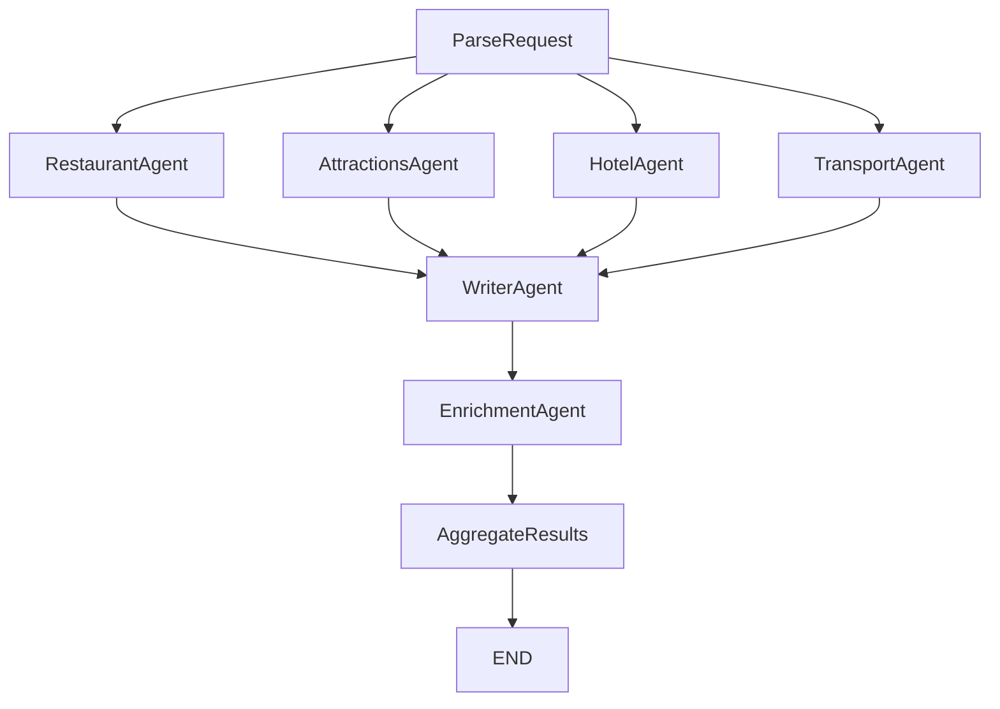

# Spot On — Technical Documentation

This document is the “Technical Docs” deliverable from the assignment. It is written to be reviewed alongside the codebase; each section includes the source-of-truth file(s) to cross-check.

## System Overview

Spot On is a multi-agent travel recommendation system with:

- **Frontend (Next.js)**: collects user input, starts a run, streams progress, and renders/export results.
- **Backend (FastAPI + LangGraph)**: parses the request, runs 4 domain agents in parallel, enriches results, and aggregates the final response.
- **MongoDB (Atlas or local)**: stores run lifecycle, progress events, and artifacts.
- **Tavily API**: provides grounded search + page extraction.
- **OpenAI**: used via structured outputs to parse/normalize results.

Primary entrypoints:

- Backend app: `backend/app/main.py`
- Graph definition: `backend/app/graph/graph.py`
- Frontend UI: `frontend/app/page.tsx`

## Architecture & Agent Roles

### LangGraph nodes (in execution order)

Source: `backend/app/graph/graph.py`, `backend/app/graph/nodes/parse.py`, `backend/app/graph/nodes/aggregate_results.py`

1. **ParseRequest** (`backend/app/graph/nodes/parse.py`)
   - Converts a free-form prompt (or accepts structured constraints) into normalized `constraints` for downstream agents.
2. **Domain Agents** (parallel fan-out; **search only** - return raw results)
   - **RestaurantAgent** (`backend/app/agents/restaurant.py`): returns top 15 raw restaurant search results.
   - **AttractionsAgent** (`backend/app/agents/attractions.py`): returns top 15 raw attraction search results.
   - **HotelAgent** (`backend/app/agents/hotel.py`): returns top 15 raw hotel search results.
   - **TransportAgent** (`backend/app/agents/transport.py`): returns 15 car rentals + 15 flights (internally parallelizes car + flight subsearches).
3. **WriterAgent** (`backend/app/agents/writer.py`)
   - Waits for all 4 domain agents to complete (fan-in join).
   - Runs **5 parallel LLM normalizations** to convert raw results into structured top picks.
   - Produces: 7 restaurants, 7 attractions, 7 hotels, 5 car rentals, 5 flights (**31 total top picks**).
   - Computes **references** field: raw items not selected as top picks (fallback options).
4. **EnrichmentAgent** (`backend/app/agents/enrichment.py`)
   - Collects URLs from all top picks (~31 items).
   - Batch calls Tavily Extract (20 URLs at once).
   - Uses LLM to parse extracted content for price, hours, address, phone.
5. **AggregateResults** (`backend/app/graph/nodes/aggregate_results.py`)
   - Merges enrichment data by `id` into each item and builds `final_output`.

### Why this is "multi-agent"

Each domain agent has a single responsibility and can evolve independently (queries, ranking, schemas, timeouts). LangGraph coordinates the workflow and ensures the WriterAgent waits for all 4 domain agents, then runs 5 parallel LLM normalizations. This **separation of search (I/O bound) from normalization (CPU bound)** enables dual parallelism for optimal performance.

## LangGraph Flow

Source: `backend/app/graph/graph.py`



- Entry point: `ParseRequest`
- **First fan-out**: `ParseRequest -> {RestaurantAgent, AttractionsAgent, HotelAgent, TransportAgent}` (4 parallel search agents)
- **First join**: `{RestaurantAgent, AttractionsAgent, HotelAgent, TransportAgent} -> WriterAgent`
- **Second parallelism**: WriterAgent internally runs 5 LLM normalizations in parallel
- Sequential: `WriterAgent -> EnrichmentAgent -> AggregateResults -> END`

**Key innovation:** Domain agents search in parallel (4x). WriterAgent waits for all 4 (join pattern), then runs 5 LLM normalizations in parallel. This dual parallelism (search + normalization) delivers ~15s total vs ~25-30s sequential.

Operational notes:

- Node execution is wrapped with `_wrap(...)` to emit progress events to MongoDB (`append_event`, `set_node_progress`).
- Join behavior is handled by LangGraph; WriterAgent waits until all 4 domain agents complete.

## Agent Roles - Detailed Responsibilities

### ParseRequest Node
**File:** `backend/app/graph/nodes/parse.py`
- Validates constraints (dates, origin, destination)
- Derives query context (destination_city, origin_code, stay_nights, etc.)
- No LLM call if constraints provided directly

### Domain Agents (Parallel Execution - Search Only)
All domain agents share the same pattern:
- Build multiple search queries
- Execute parallel Tavily searches
- Deduplicate by URL
- Return TOP_N raw results sorted by relevance score
- **No LLM normalization** (handled by WriterAgent)

**RestaurantAgent** (`backend/app/agents/restaurant.py`)
- TOP_N = 15 raw results
- Queries: "best restaurants", "local favorites", "hidden gems"
- Returns: `raw_restaurants`

**AttractionsAgent** (`backend/app/agents/attractions.py`)
- TOP_N = 15 raw results
- Queries: "must see attractions", "top things to do", "best places to visit"
- Returns: `raw_travel_spots`

**HotelAgent** (`backend/app/agents/hotel.py`)
- TOP_N = 15 raw results
- Queries: "best hotels", "top rated hotels"
- Returns: `raw_hotels`

**TransportAgent** (`backend/app/agents/transport.py`)
- CAR_TOP_N = 15, FLIGHT_TOP_N = 15
- Internally parallelizes car rental + flight searches
- Returns: `raw_car_rentals`, `raw_flights`

### WriterAgent (5 Parallel LLM Calls)
**File:** `backend/app/agents/writer.py`

**Purpose:** Normalizes raw search results into structured top picks using specialized prompts.

**Execution:**
- Waits for all 4 domain agents to complete (LangGraph join)
- Runs 5 LLM normalization calls in parallel using `asyncio.gather`
- Each category uses domain-specific prompts with guardrails

**Output counts:**
- 7 restaurants (RESTAURANT_TOP = 7)
- 7 attractions (ATTRACTION_TOP = 7)
- 7 hotels (HOTEL_TOP = 7)
- 5 car rentals (CAR_TOP = 5)
- 5 flights (FLIGHT_TOP = 5)
- **Total: 31 top picks**

**References field:**
- Computes items from raw_* that weren't selected as top picks
- Provides fallback options if enrichment fails

**Why separate normalization from search?**
- Search is I/O bound (parallel Tavily calls)
- Normalization is CPU bound (LLM processing)
- Allows independent scaling and optimization
- Prevents redundant search queries when LLM needs retry

### EnrichmentAgent (Tavily Extract + LLM Parsing)
**File:** `backend/app/agents/enrichment.py`
- Collects URLs from all top picks (~31 items)
- Batch calls Tavily extract (20 URLs at once)
- Uses LLM to parse extracted content for price, hours, address, phone
- Returns: `enriched_data` dict (item_id → enriched fields)

### AggregateResults Node
**File:** `backend/app/graph/nodes/aggregate_results.py`
- Merges enriched_data into each item by ID
- Builds final_output with all categories
- Returns status "done"

## State Management Design

**File:** `backend/app/graph/state.py`

**Key patterns:**

### Raw Fields (Parallel Merge with operator.add)
```python
raw_restaurants: Annotated[list[dict[str, Any]], operator.add]
raw_travel_spots: Annotated[list[dict[str, Any]], operator.add]
raw_hotels: Annotated[list[dict[str, Any]], operator.add]
raw_car_rentals: Annotated[list[dict[str, Any]], operator.add]
raw_flights: Annotated[list[dict[str, Any]], operator.add]
```
- Each domain agent writes to its raw_* field
- LangGraph merges lists automatically when parallel agents complete
- WriterAgent reads from raw_* fields

### Top Picks (Overwrite)
```python
restaurants: list[dict[str, Any]]
travel_spots: list[dict[str, Any]]
hotels: list[dict[str, Any]]
car_rentals: list[dict[str, Any]]
flights: list[dict[str, Any]]
```
- WriterAgent writes normalized top picks
- Overwrites (not appends)

### References
```python
references: list[dict[str, Any]]
```
- Raw items not selected as top picks
- Provides fallback if enrichment fails
- Computed by WriterAgent

### Agent Statuses (Parallel Merge with operator.or_)
```python
agent_statuses: Annotated[dict[str, str], operator.or_]
```
- Each agent writes `{agent_id: "completed"|"failed"|"partial"}`
- LangGraph merges dicts: `{a: 1} | {b: 2} = {a: 1, b: 2}`

### Warnings (Parallel Merge with operator.add)
```python
warnings: Annotated[list[str], operator.add]
```
- Each agent can add warning strings
- LangGraph concatenates lists from parallel agents

## Prompt Engineering Strategy

**File:** `backend/app/agents/prompt.py`

**Design decision:** 5 specialized prompts instead of 1 mega-prompt

**Why?**
- Domain-specific guardrails (cuisine diversity, per-night pricing, etc.)
- Different output structures per category
- Easier to iterate and tune per domain
- Prevents prompt conflicts

**Key guardrails:**

### Restaurants (`build_restaurant_prompt`)
- "Ensure at least 3 different cuisine types in final list"
- Prevents output like "5 Italian restaurants"
- Forces diversity for first-day dining

### Attractions (`build_attractions_prompt`)
- "Span different categories (cultural + nature + landmark)"
- "Avoid too many of the same kind"
- Ensures varied experiences

### Hotels (`build_hotel_prompt`)
- "Extract per-night pricing where available"
- "Per-night rate with currency (e.g., '$150', 'KRW 180,000')"
- Critical for budget planning

### Car Rentals (`build_car_rental_prompt`)
- Pick-up/drop-off location validation
- Vehicle type categorization

### Flights (`build_flight_prompt`)
- Distinguishes one-way vs round-trip
- Validates origin/destination codes

## Error Handling & Graceful Degradation

**Pattern:** Agents never raise exceptions to the graph

**Implementation:**
- Each agent has try/except wrapper
- On error: return `{"agent_statuses": {agent_id: "failed"}, "warnings": [error_msg]}`
- Graph continues with partial results

**Example:** If RestaurantAgent fails:
- WriterAgent receives empty `raw_restaurants`
- WriterAgent continues normalizing other categories
- Final output includes 0 restaurants + warning
- User sees 4/5 categories (not total failure)

**Agent status values:**
- `"completed"` - Full success
- `"failed"` - Total failure (returns empty results)
- `"partial"` - Some results but with issues (e.g., timeout mid-search)
- `"skipped"` - Intentionally skipped (e.g., skip_enrichment=true)

**Warnings array:**
- Accumulated from all agents
- Displayed to user in final_output
- Examples: "Restaurant search timeout", "Enrichment partial (10/20 URLs failed)"

## Performance Analysis

### Architecture Comparison

**OLD (Sequential):**
```
ParseRequest (500ms) → RestaurantAgent+LLM (4s) → AttractionsAgent+LLM (3s) → HotelAgent+LLM (4s) → TransportAgent+LLM (5s) → Enrichment (5s) = ~21s
```

**NEW (Parallel with WriterAgent):**
```
ParseRequest (500ms) → [4 search agents parallel] (5s max) → WriterAgent 5 LLMs (6s) → Enrichment (5s) = ~16s
```

**Key insight:** Separating search from normalization allows:
- 4x parallelism on search (I/O bound)
- 5x parallelism on normalization (CPU bound)
- No redundant searches on LLM retry

### Flow Details
1. **ParseRequest:** ~500ms (LLM constraint extraction)
2. **Domain agents (parallel):** ~3-5s (4 agents execute simultaneously)
3. **WriterAgent:** ~5-6s (5 parallel LLM normalizations)
4. **EnrichmentAgent:** ~4-5s (Tavily extract batch + LLM parsing)
5. **AggregateResults:** ~100ms (merge enriched data)

**Total:** ~13-17s (average 15s)
**Peak parallelism:** 4 agents during search, 5 LLMs during normalization

## Data Model (MongoDB)

Source: `backend/app/db/mongo.py`, `backend/app/db/schemas.py`, `backend/app/main.py`

MongoDB collections:

### `runs`

One document per run.

- `_id`: run id (string, e.g. `run_...`)
- `status`: `queued | running | done | error | cancelled`
- `createdAt`, `updatedAt`
- `prompt`: original prompt (string)
- `options`: feature flags (e.g. `skip_enrichment`)
- `constraints`: parsed or provided structured constraints
- `warnings`: array of strings
- `final_output`: aggregated output payload (stored on completion)
- `error`: `{ message: string }` on failure
- `progress.nodes.<NodeName>`: last known `NodeEventPayload` per node
- `durationMs`
- `runType`: `"spot_on"`
- `apiVersion`: `1`

Indexes (created on startup):

- `runs.updatedAt`
- `runs.status + runs.updatedAt`

### `run_events`

Append-only event log for SSE streaming.

- `runId`, `ts`
- `type`: `node | artifact | log`
- `node`: node name (optional)
- `payload`: event payload

Index:

- `runId + ts + _id`

### `artifacts`

Materialized intermediate/final artifacts.

- `runId`, `ts`
- `type` (e.g. `constraints`, `final_output`)
- `payload`
- `version`

Index:

- `runId + ts + _id`

## Backend API Surface

Source: `backend/app/main.py`

- `POST /api/runs`: create a run, enqueue execution, return `{ runId }`.
- `GET /api/runs/{runId}`: fetch run status + progress + output (when done).
- `GET /api/runs/{runId}/events`: SSE stream of progress/events.
- `POST /api/runs/{runId}/cancel`: best-effort cancellation (cancels background task).
- `GET /api/runs/{runId}/export/pdf`: export results as PDF (done-only).
- `GET /api/runs/{runId}/export/xlsx`: export results as XLSX (done-only).

SSE behavior notes:

- Uses MongoDB change streams when available; falls back to polling for standalone/local Mongo. See the `PyMongoError` fallback path in `backend/app/main.py`.

## Frontend Integration

Source: `frontend/lib/api.ts`, `frontend/lib/sse.ts`, `frontend/next.config.js`, `frontend/app/api/**`

- The browser uses relative paths (e.g. `/api/runs`) and relies on proxying/route handlers.
- Configure backend base URL via `NEXT_PUBLIC_API_URL` (defaults to `http://localhost:8000`).
- SSE uses `EventSource` to `/api/runs/{runId}/events`.

## Deployment Guide (AWS + MongoDB Atlas)

This repo supports local development and container-based deployment.

### Required environment variables

Source: `backend/app/config.py`, `backend/.env.example`, `frontend/.env`

Backend:

- `OPENAI_API_KEY`
- `OPENAI_MODEL` (default: `gpt-5-nano`)
- `TAVILY_API_KEY`
- `MONGODB_URI` (Atlas connection string recommended for AWS)
- `DB_NAME` (default: `travel_planner`)
- `CORS_ORIGINS` (comma-separated, e.g. `https://your-ui.example,https://www.your-ui.example`)

Frontend:

- `NEXT_PUBLIC_API_URL` (e.g. `https://your-backend.example`)

### Local (recommended for development)

Source: `README.md`, `backend/docker-compose.yml`

- Run Mongo locally (Docker is simplest).
- Run backend with `uvicorn`.
- Run frontend with `bun` dev server.

### AWS Elastic Beanstalk (Docker platform)

Source: `backend/Dockerfile`, `backend/.elasticbeanstalk/config.yml`

High-level steps:

1. Provision MongoDB Atlas (replica set) and whitelist your EB security group / outbound IP policy.
2. Create an Elastic Beanstalk environment using the **Docker** platform.
3. Deploy the backend container built from `backend/Dockerfile`.
4. Set EB environment variables (`OPENAI_API_KEY`, `TAVILY_API_KEY`, `MONGODB_URI`, `CORS_ORIGINS`, etc.).
5. Point the frontend at the EB URL via `NEXT_PUBLIC_API_URL` and deploy the UI (any hosting is fine: Vercel/S3+CloudFront/etc.).

Production notes:

- Prefer Atlas over a self-hosted MongoDB on EC2 for reliability and simpler ops.
- Ensure `CORS_ORIGINS` includes your production UI origin(s).
- Confirm the backend can reach Atlas (network rules + DNS).

## Review Checklist (Staff / Eng Lead)

The goal is to ensure the “Technical Docs” are consistent with the code and runnable.

- **Architecture matches code**: verify node names/edges in `backend/app/graph/graph.py` and the diagram in `README.md`.
- **Agent responsibilities are accurate**: spot-check each agent file under `backend/app/agents/`.
- **DB schema is current**: confirm fields and indexes match `backend/app/db/mongo.py` and the API response models in `backend/app/db/schemas.py`.
- **Deployment steps match repo config**: confirm the container entrypoint in `backend/Dockerfile` and EB config in `backend/.elasticbeanstalk/config.yml`.
- **End-to-end smoke test**: run backend + frontend locally, create a run, confirm SSE updates, and confirm a `runs` document and `run_events` inserts occur.
