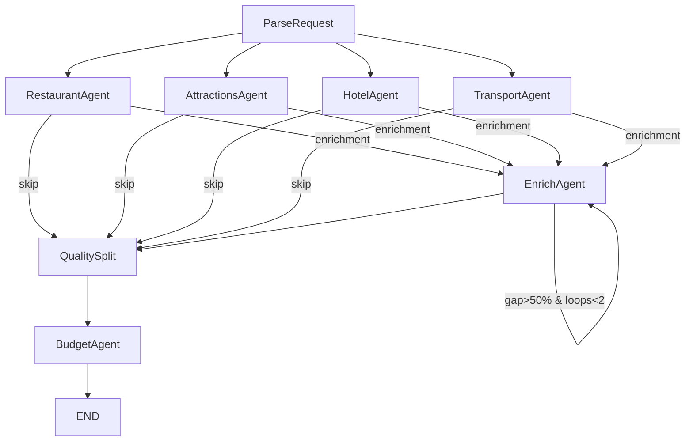

# Spot On — Technical Documentation

## System Overview
Spot On is a multi-agent travel recommendation system with:

- **Frontend (Next.js)**: collects user input, recommends a destination, starts a run, streams progress, and renders/exports results.
- **Backend (FastAPI + LangGraph)**: validates constraints, runs 4 domain agents in parallel, optionally enriches missing fields, applies quality gating, and generates a budget report + final output.
- **MongoDB (Atlas or local)**: stores run lifecycle, progress events, and artifacts.
- **Tavily API**: provides grounded search + page extraction.
- **OpenAI**: used via structured outputs to parse/normalize results.

Primary entrypoints:
- Backend app: `backend/app/main.py`
- Graph definition: `backend/app/graph/graph.py`
- Frontend UI: `frontend/app/page.tsx`

## Architecture & Agent Roles

### LangGraph
Source: `backend/app/graph/graph.py`

1. **ParseRequest** (`backend/app/graph/nodes/parse.py`)
   - Validates structured `constraints` and derives `query_context` (destination city, airport codes when available, trip type, stay nights, etc.).
2. **Domain Agents** (parallel fan-out; each agent performs **search + normalize**)
   - **RestaurantAgent** (`backend/app/agents/restaurant.py`): Tavily search → LLM structured normalization → `restaurants[]`.
   - **AttractionsAgent** (`backend/app/agents/attractions.py`): Tavily search → LLM structured normalization → `travel_spots[]`.
   - **HotelAgent** (`backend/app/agents/hotel.py`): Tavily search → LLM structured normalization → `hotels[]`.
   - **TransportAgent** (`backend/app/agents/transport.py`): parallel car + flight search → LLM normalization → `car_rentals[]`, `flights[]`.
3. **EnrichAgent** (`backend/app/agents/enrichment.py`)
   - Optional (controlled by `skip_enrichment`).
   - Uses Tavily Extract (and targeted follow-up search) to fill missing enrichable fields across categories.
   - May loop a bounded number of times based on `enrichment_gap_ratio` and `enrichment_loop_count`.
4. **QualitySplit** (`backend/app/graph/nodes/quality_split.py`)
   - Applies required-field gating; demotes items missing critical fields into `references[]`.
5. **BudgetAgent** (`backend/app/agents/budget.py`)
   - Produces a lightweight budget report (`report.total_estimated_budget`) and materializes `final_output`.

### Why this is "multi-agent"
Each domain agent has a single responsibility and can evolve independently (queries, schemas, timeouts). LangGraph coordinates the workflow end-to-end, including parallel domain work, optional enrichment, quality gating, and reporting.

## LangGraph Flow
Source: `backend/app/graph/graph.py`



- Entry point: `ParseRequest`
- **Fan-out**: `ParseRequest -> {RestaurantAgent, AttractionsAgent, HotelAgent, TransportAgent}` (4 parallel domain agents)
- **Conditional path**: each domain agent routes to `EnrichAgent` unless `skip_enrichment=true`, in which case it routes directly to `QualitySplit`.
- **Enrichment loop**: `EnrichAgent` may loop based on a gap ratio threshold and loop count cap.
- Sequential: `QualitySplit -> BudgetAgent -> END`

Operational notes:
- Node execution is wrapped with `_wrap(...)` to emit progress events to MongoDB (`append_event`, `set_node_progress`).

## Agent Roles - Detailed Responsibilities

### ParseRequest Node
**File:** `backend/app/graph/nodes/parse.py`
- Validates constraints (dates, origin, destination)
- Derives deterministic `query_context` (origin/destination city, IATA codes when present, trip type, stay nights, year)

### Domain Agents (Parallel Execution - Search + Normalize)
All domain agents share the same high-level pattern:
- Build multiple search queries (deterministic)
- Execute parallel Tavily searches
- Deduplicate by URL
- Keep the top N items by score (configured via `SEARCH_TOP_N`)
- Normalize results into structured outputs using the LLM (chunked via `NORMALIZE_CHUNK_SIZE`)

**RestaurantAgent** (`backend/app/agents/restaurant.py`)
- Produces: `restaurants[]`

**AttractionsAgent** (`backend/app/agents/attractions.py`)
- Produces: `travel_spots[]`

**HotelAgent** (`backend/app/agents/hotel.py`)
- Produces: `hotels[]`

**TransportAgent** (`backend/app/agents/transport.py`)
- Internally parallelizes car rental + flight searches
- Produces: `car_rentals[]`, `flights[]`

### EnrichAgent (Tavily Extract + targeted follow-up search)
**File:** `backend/app/agents/enrichment.py`
- Scans output items for missing enrichable fields.
- Uses Tavily Extract in batches; may also generate targeted search queries to locate missing information (LLM generated queries).
- Returns: `enriched_data` (item_id → enriched fields), plus `enrichment_gap_ratio` and `enrichment_loop_count`.

### QualitySplit Node (quality gating)
**File:** `backend/app/graph/nodes/quality_split.py`
- Merges `enriched_data` into items (fills only missing fields).
- Demotes items missing critical fields into `references[]`.
- Produces: `main_results` (category → list of items that passed gating).

### BudgetAgent (budget report + final output)
**File:** `backend/app/agents/budget.py`
- Uses `main_results` to generate `report.total_estimated_budget` (best-effort).
- Materializes `final_output` (category arrays, `constraints`, `references`, optional `report`).


## State Management Design

**File:** `backend/app/graph/state.py`

**Key patterns:**

### Core state keys
```python
constraints: dict[str, Any]
query_context: dict[str, Any]

restaurants: list[dict[str, Any]]
travel_spots: list[dict[str, Any]]
hotels: list[dict[str, Any]]
car_rentals: list[dict[str, Any]]
flights: list[dict[str, Any]]

enriched_data: dict[str, dict[str, Any]]
main_results: dict[str, list[dict[str, Any]]]
references: list[dict[str, Any]]

travel_report: dict[str, Any]
final_output: dict[str, Any]
```

### Agent Statuses (Parallel Merge with operator.or_)
```python
agent_statuses: Annotated[dict[str, str], operator.or_]
```
- Each agent writes `{agent_id: "completed"|"failed"|"partial"}`
- LangGraph merges dicts: `{a: 1} | {b: 2} = {a: 1, b: 2}`

### Warnings (Parallel Merge with operator.add)
```python
warnings: Annotated[list[str], operator.add]
```


## Data Model (MongoDB)

Source: `backend/app/db/mongo.py`, `backend/app/db/schemas.py`, `backend/app/main.py`

MongoDB collections:
### `runs` (One run per request)
- `_id`: run id (string, e.g. `run_...`)
- `status`: `queued | running | done | error | cancelled`
- `createdAt`, `updatedAt`
- `options`: feature flags (e.g. `skip_enrichment`)
- `constraints`: structured TravelConstraints (origin, destination, departing_date, returning_date)
- `warnings`: array of strings (accumulated from agents)
- `final_output`: aggregated output (see structure below)
- `error`: `{ message: string }` on failure
- `progress.nodes.<NodeName>`: last known `NodeEventPayload` per node (Queue, ParseRequest, RestaurantAgent, AttractionsAgent, HotelAgent, TransportAgent, EnrichAgent, QualitySplit, BudgetAgent)
- `runType`: `"spot_on"`
- `apiVersion`: `2`

**`final_output` structure** (when `status=done`):

- `restaurants`, `travel_spots`, `hotels`, `car_rentals`, `flights`: arrays of items that passed `QualitySplit`
- `references`: array of demoted/extra items
- `constraints`: echoed constraints used for the run
- `report`: optional budget report (`total_estimated_budget`)

Indexes (created on startup):
- `runs.updatedAt`
- `runs.status + runs.updatedAt`


### `run_events` (Append-only event log for SSE streaming)
- `runId`, `ts`
- `type`: `node | artifact | log`
- `node`: node name (optional)
- `payload`: event payload

Index:
- `runId + ts + _id`

### `artifacts` (Materialized intermediate/final artifacts)
- `runId`, `ts`
- `type` (e.g. `constraints`, `final_output`)
- `payload`
- `version`

Index:
- `runId + ts + _id`

## Backend API Surface
Source: `backend/app/main.py`
- `POST /recommend`: recommend a destination based on user preferences.
- `POST /runs`: create a run with structured `constraints`, enqueue execution, return `{ runId }`.
- `GET /runs/{runId}`: fetch run status + progress + output (when done).
- `GET /runs/{runId}/events`: SSE stream of progress/events.
- `POST /runs/{runId}/cancel`: best-effort cancellation (cancels background task).
- `GET /runs/{runId}/export/pdf`: export results as PDF (done-only).
- `GET /runs/{runId}/export/xlsx`: export results as XLSX (done-only).


## Frontend Integration
Source: `frontend/lib/api.ts`, `frontend/lib/sse.ts`, `frontend/next.config.js`
- Run orchestration uses relative paths (e.g. `/runs`) and relies on `frontend/next.config.js` rewrites to `NEXT_PUBLIC_API_URL` (defaults to `http://localhost:8000`).
- Destination recommendation calls the backend directly (see `recommendDestination(...)` in `frontend/lib/api.ts`), so backend `CORS_ORIGINS` must include the UI origin.
- SSE uses `EventSource` to `{NEXT_PUBLIC_API_URL}/runs/{runId}/events` (also requires backend CORS).

## Deployment Guide (AWS + MongoDB Atlas)
This repo supports local development and container-based deployment.

### Required environment variables
Source: `backend/app/config.py`, `backend/.env.example`, `frontend/.env.example`

Backend:
- `OPENAI_API_KEY`
- `OPENAI_MODEL` (default: `gpt-4o-mini`)
- `OPENAI_TIMEOUT`
- `TAVILY_API_KEY`
- `TAVILY_SEARCH_TIMEOUT`
- `TAVILY_EXTRACT_TIMEOUT`
- `MONGODB_URI` 
- `DB_NAME`
- `CORS_ORIGINS` (e.g.: `http://localhost:3000`)

Optional tuning (defaults in `config.py`):
- `AGENT_SEARCH_TIMEOUT`
- `AGENT_TRANSPORT_TIMEOUT`
- `AGENT_BUDGET_TIMEOUT`
- `AGENT_ENRICH_TIMEOUT`
- `TAVILY_MAX_RESULTS`
- `TAVILY_CALL_CAP`
- `SEARCH_TOP_N`
- `NORMALIZE_CHUNK_SIZE`

Frontend:
- `NEXT_PUBLIC_API_URL` (e.g. `http://localhost:8000`)

### Local Deployment

**MongoDB:**
```bash
docker run -d -p 27017:27017 -v mongo-data:/data/db --name travel-mongo mongo:7
```

**Backend:**
```bash
cd backend
uv venv && source .venv/bin/activate
uv pip install -e .
cp .env.example .env  # Edit with your API keys
uv run uvicorn app.main:app --reload
```

**Frontend:**
```bash
cd frontend
bun install
cp .env.example .env.local  # Set NEXT_PUBLIC_API_URL
bun run dev
```

---

### AWS Elastic Beanstalk Deployment

**Setup:**
```bash
pip install awsebcli
cd backend
eb init -p docker spot-on-api --region us-west-2
```

**Deploy:**
```bash
# Create environment
eb create spot-on-prod --instance-type t3.medium

# Set environment variables
eb setenv \
  OPENAI_API_KEY=xxx \
  TAVILY_API_KEY=yyy \
  MONGODB_URI=mongodb+srv://... \
  CORS_ORIGINS=https://your-domain.com

# Deploy updates
eb deploy
```

**Manage:**
```bash
eb logs              # View logs
eb logs --stream     # Stream logs
eb ssh               # SSH into instance
eb scale 3           # Scale instances
eb terminate         # Terminate environment
```

**Frontend (Vercel):**
```bash
cd frontend
echo "NEXT_PUBLIC_API_URL=https://your-eb-url.elasticbeanstalk.com" > .env.production
vercel --prod
```
